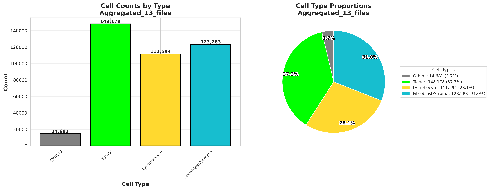
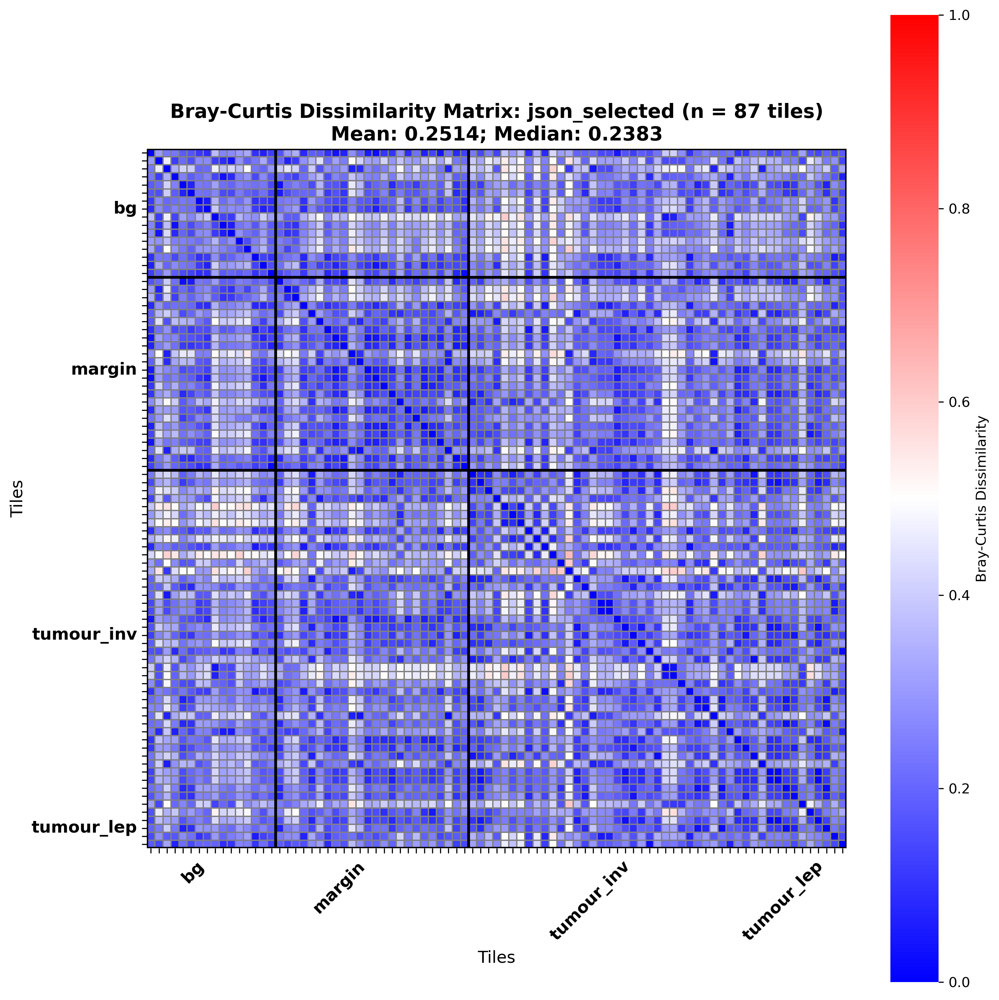
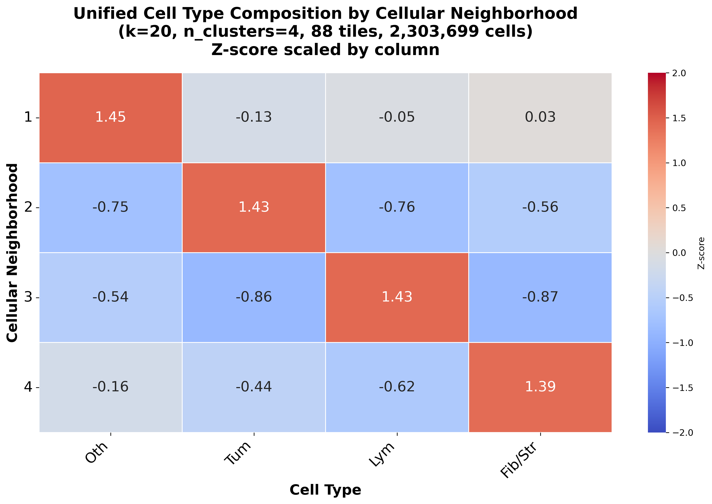
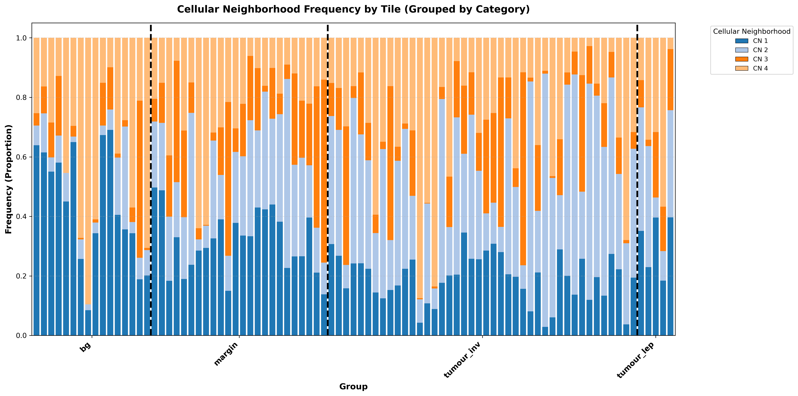
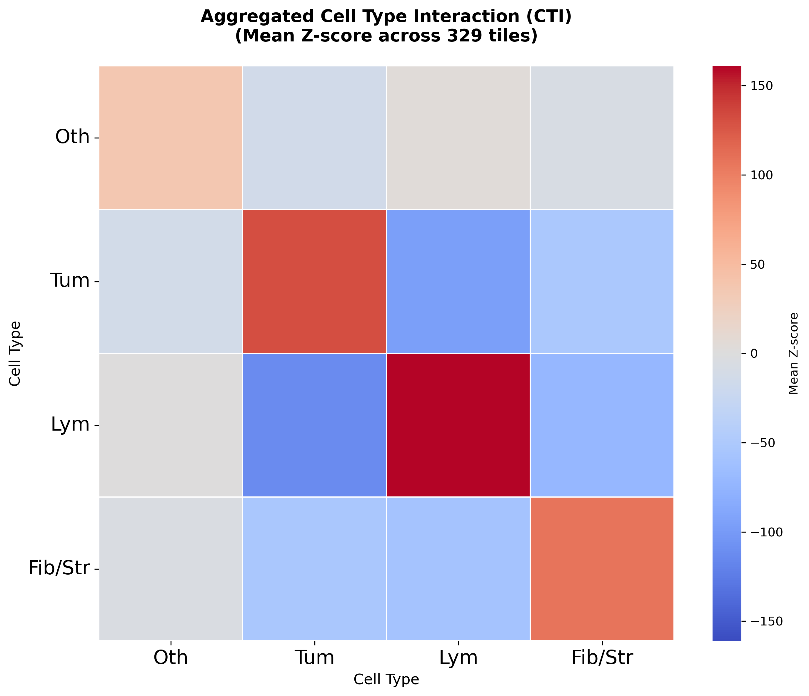

# HandE Analysis

Spatial and compositional analysis of **NucSegAI** cell-type predictions on H&E tissue tiles.

Given per-tile prediction JSONs (4 classes: Others, Tumor, Lymphocyte, Fibroblast/Stroma), this repo can:

1. **Summarize composition** — cell-type counts, proportions, densities, and confidence across tiles
2. **Compare tiles** — Bray–Curtis dissimilarity of cell-type mixtures (overall, by tissue group, per case)
3. **Find cellular neighborhoods (CNs)** — unified k-means CNs across tiles, with group-wise maps and optional subclustering
4. **Measure cell-type interactions (CTI)** — neighborhood-enrichment z-scores per tile and cohort-level averages

Cell-type names and colors are defined in `[type_info_4class.json](type_info_4class.json)`. Spatial analysis starts from `.h5ad` tiles produced by `neighborhood_composition/data_preparation.py`.

Our development and testing were done on a Windows 11 PC with Windows Subsystem for Linux ([WSL](https://learn.microsoft.com/en-us/windows/wsl/install)).

---


## Setup

Requires [Conda](https://docs.conda.io/) (or Miniconda/Mamba) and Python ≥ 3.10. Create an environment and install dependencies from [requirements.txt](requirements.txt):

```bash
conda create -n hande_analysis python=3.13 -y
conda activate hande_analysis
pip install -r requirements.txt
```

---


## Modules


| Module                     | What it does                                       | Docs                                                                          |
| -------------------------- | -------------------------------------------------- | ----------------------------------------------------------------------------- |
| **Quantitative analysis**  | Cohort cell-type summaries + Bray–Curtis           | [qa_README.md](quantitative_analysis/qa_README.md)                            |
| **Cellular neighborhoods** | Unified CN detection, visualization, subclustering | [cn_README.md](neighborhood_composition/spatial_contexts/cn_README.md)        |
| **Cell-type interaction**  | Per-tile + aggregated CTI heatmaps                 | [cti_README.md](neighborhood_composition/cell_type_interaction/cti_README.md) |


Preparation script (JSON → `.h5ad`): `neighborhood_composition/data_preparation.py` / `run_data_preparation.sh`.

---

## Example outputs

**Cell-type distribution (counts + proportions)**



**Overall Bray–Curtis (all categorized tiles)**



**CN composition heatmap**



**Per-tile CN frequency (all groups)**



**Mean CTI across tiles**



---


## Suggested workflow

```text
NucSegAI JSON tiles
  ├─► quantitative_analysis/     # composition + Bray–Curtis
  │
  └─► data_preparation.py        # JSON → h5ad
        ├─► spatial_contexts/    # cellular neighborhoods
        └─► cell_type_interaction/  # CTI
```

See the module READMEs above for commands and full figure sets.