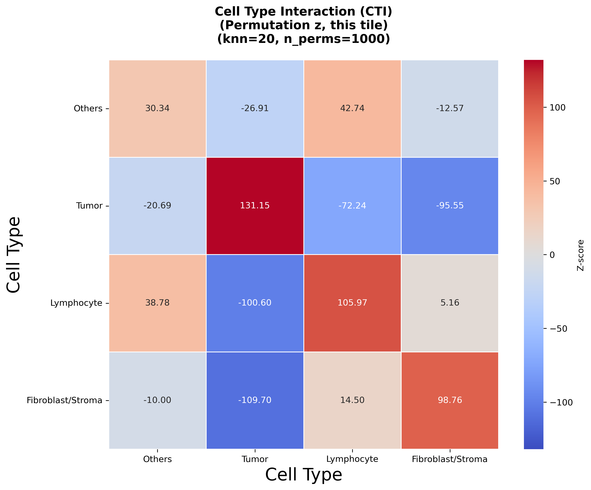
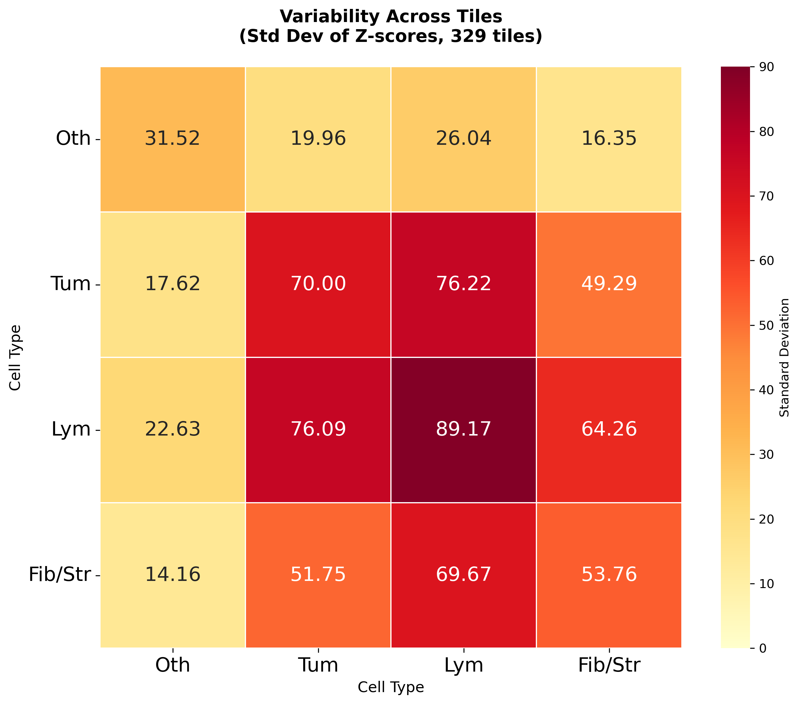

# Cell Type Interaction (CTI)

Spatial cell-type interaction analysis for NucSegAI / HandE tile AnnData (`.h5ad`) files.

Typical workflow (after `data_preparation.py` has produced `.h5ad` tiles):

```text
h5ad tiles  →  cti_batch.py  →  per-tile outputs  →  cti_aggregate.py  →  cohort summary
                 ↑
            uses cti_tiled.py
```

Cell types follow `type_info_4class.json` (Others, Tumor, Lymphocyte, Fibroblast/Stroma) via labels written into each `.h5ad` by data preparation.

---

## Scripts

### `cti_tiled.py` — core library + single-tile pipeline

Shared functions used by batch and aggregate:

- Build spatial neighborhood graph (radius or k-NN)
- Squidpy neighborhood enrichment (CTI z-scores)
- Co-occurrence / centrality helpers
- Heatmaps and interaction summaries
- Save / load intermediate `zscore.npy` + `metadata.json`
- Aggregate z-scores across tiles (`aggregate_from_saved_results`)

Also provides `run_spatial_analysis_pipeline()` for **one** tile (useful for debugging or a quick check).

**Example (edit paths in** `__main__`**, then run):**

```bash
cd neighborhood_composition/cell_type_interaction
python cti_tiled.py
```

Or call from Python:

```python
from cti_tiled import run_spatial_analysis_pipeline

adata = run_spatial_analysis_pipeline(
    adata_path="/path/to/tile.h5ad",
    output_dir="spatial_analysis_results",
    n_neighbors=20,
    n_perms=1000,
    save_adata=False,
    skip_cooccurrence=True,
)
```

**Per-tile outputs (example):**

- `spatial_distribution.png`
- `cell_type_interaction.png`
- `significant_interactions.csv`
- optional `adata_with_spatial_analysis.h5ad`

---


### `cti_batch.py` — run CTI on many tiles

Scans a directory of `.h5ad` files, runs the same analysis as `cti_tiled` on each tile, and writes one subdirectory per tile.

Features:

- Skips tiles that already have complete outputs (resume-friendly)
- Saves intermediate files needed by aggregation (`*_zscore.npy`, `*_metadata.json`)
- Does **not** compute cohort-level summaries (use `cti_aggregate.py` next)

**Example (edit paths in** `__main__`**, then run):**

```bash
cd neighborhood_composition/cell_type_interaction
python cti_batch.py
```

Or call from Python:

```python
from cti_batch import run_multiple_tiles_pipeline

results = run_multiple_tiles_pipeline(
    tiles_directory="/mnt/j/HandE/results/Final/pred/h5ad",
    output_dir="cti_multiple_tiles",
    n_neighbors=20,
    n_perms=1000,
    cluster_key="cell_type",
    skip_cooccurrence=True,
    file_pattern="*.h5ad",
)
```

**Layout after a successful run:**

```text
cti_multiple_tiles/
  <tile_name>/
    <tile_name>_cti.png
    <tile_name>_spatial_distribution.png
    <tile_name>_significant_interactions.csv
    <tile_name>_zscore.npy
    <tile_name>_metadata.json
    ...
```

### Example per-tile result



Then aggregate:

```bash
python cti_aggregate.py --input_dir cti_multiple_tiles --n_perms 1000 --n_neighbors 20
```

---


### `cti_aggregate.py` — cohort-level summary from batch outputs

Reads all per-tile folders under `--input_dir` and produces:

- Mean / std / median CTI z-score matrices and heatmaps
- Interaction consistency tables
- Per-tile summary CSV

**Example:**

```bash
cd neighborhood_composition/cell_type_interaction

python cti_aggregate.py \
  --input_dir cti_multiple_tiles \
  --n_perms 1000 \
  --n_neighbors 20
```

**Useful options:**

| Flag                          | Meaning                                                |
| ----------------------------- | ------------------------------------------------------ |
| `--input_dir`                 | Batch output directory (default: `cti_multiple_tiles`) |
| `--n_perms` / `--n_neighbors` | Shown in plot titles (match what you used in batch)    |
| `--no-short-cell-type-labels` | Use full names on heatmap axes                         |
| `--heatmap-annot-fontsize`    | Font size for numbers inside heatmaps                  |

**Key outputs (written into** `--input_dir`**):**

- `aggregated_mean_cti.png` / `aggregated_mean_zscore.csv`
- `aggregated_variability.png` / `aggregated_std_zscore.csv`
- `aggregated_median_zscore.csv`
- `all_tiles_interactions.csv`
- `interaction_consistency.csv`
- `tiles_summary.csv`

### Example aggregated results

**Mean CTI across tiles**


**CTI variability (std) across tiles**



---


## Suggested end-to-end usage

```bash
# 1) JSON → h5ad (from neighborhood_composition/)
./run_data_preparation.sh

# 2) Per-tile CTI
cd cell_type_interaction
# Edit tiles_directory / output_dir in cti_batch.py if needed
python cti_batch.py

# 3) Aggregate across tiles
python cti_aggregate.py \
  --input_dir cti_multiple_tiles \
  --n_perms 1000 \
  --n_neighbors 20
```


## Notes

- Relative image paths assume this README lives in `cell_type_interaction/` next to `example_pic/`.
- Scripts `chdir` to this folder when started; relative output paths are relative to `cell_type_interaction/`.
- Batch graph method follows `cti_tiled`’s pipeline defaults (k-NN with `n_neighbors`; radius is kept for compatibility / titles).
- Prefer focusing on interactions that appear consistently across many tiles (`interaction_consistency.csv`).
