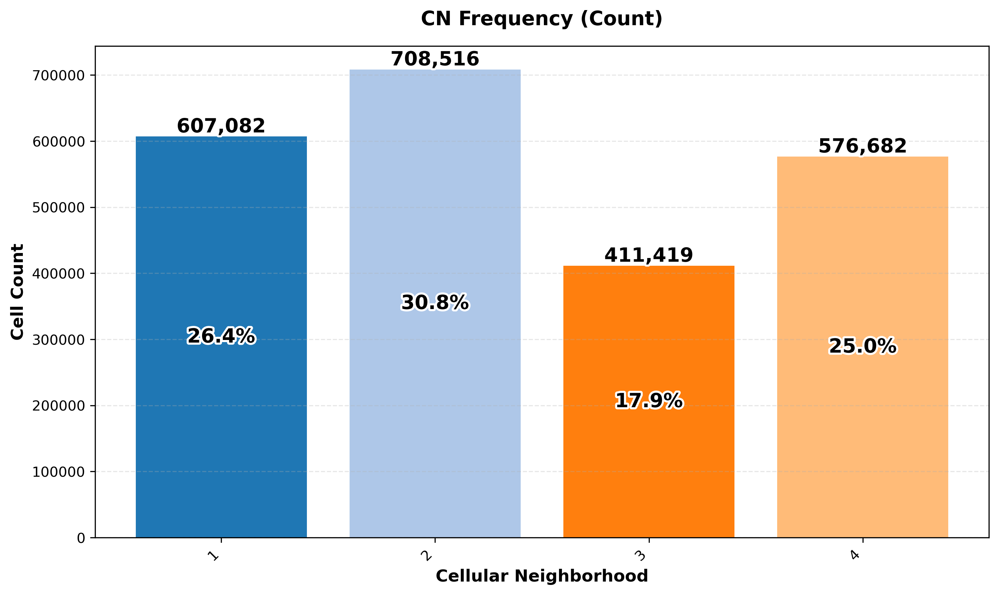
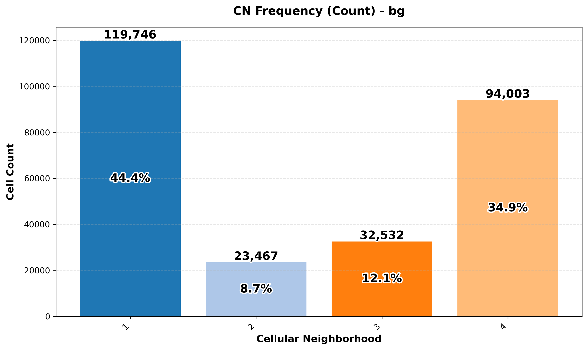
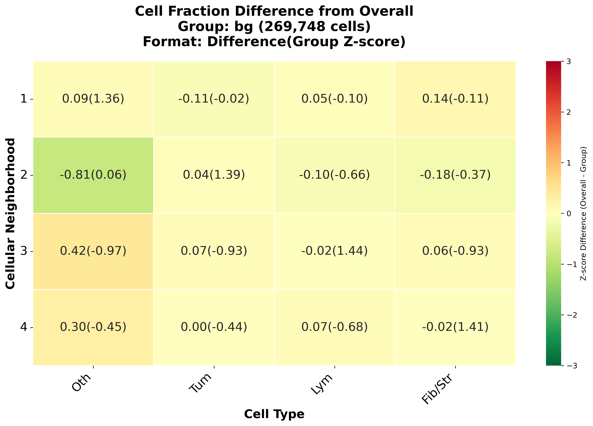
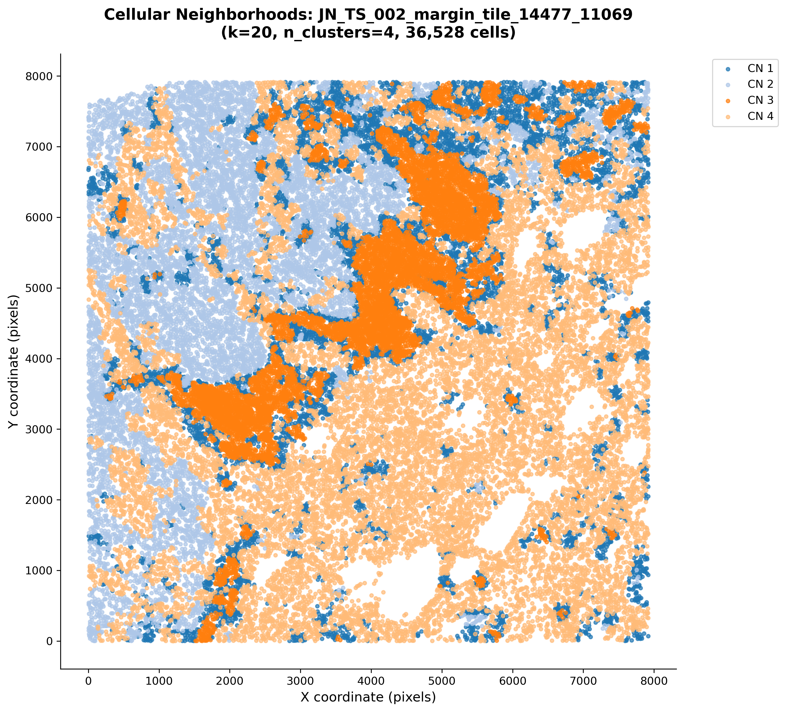

# Spatial Contexts & Cellular Neighborhoods (CN)

Scripts for **unified cellular neighborhood (CN)** detection across HandE tiles, choosing how many neighborhoods to use, refining selected ones further, and visualization by tissue group.

Inputs are per-tile `.h5ad` files from `neighborhood_composition/data_preparation.py` (4-class labels: Others, Tumor, Lymphocyte, Fibroblast/Stroma). These source h5ad files are never modified by anything below — CN labels are written separately as lightweight per-tile JSON files and merged back in at read time.

---

## Suggested pipeline

```text
h5ad tiles (from data_preparation.py, untouched throughout)
  ├─► cn_kmeans_sweep.py           # 0. (optional) sweep n_clusters, pick a value via elbow/silhouette
  │
  ├─► cn_unified_kmeans.py   # 1. define shared CNs (core) -> writes cn_labels/*.json
  │     │
  │     ├─► vis_kmeans.py          # 2a. composition heatmap, frequency charts, group comparisons
  │     ├─► print_cn_tiles.py      # 2b. individual per-tile spatial CN maps (slow, skippable)
  │     │
  │     └─► cn_subcluster.py       # 3. (optional) split selected CNs into finer sub-groups
  │           └─► re-run 2a/2b on the sub-clustered cn_labels/ to visualize the result
```

Supporting data:
- `tile_categories_88_tiles.json` — tile → group (`bg`, `margin`, `tumour_inv`, …), used by `vis_kmeans.py`
- an optional tile-selection CSV (header `tile`, one tile name per row) — supported by every script below, to restrict analysis to a subset of tiles (e.g. excluding some for QC reasons) without moving or deleting files

Each script also has a matching `run_*.sh` wrapper (e.g. `run_cn_kmeans_local.sh`) with a `CONFIG` block at the top — edit the paths/parameters there and run with no arguments, or pass `-- --flag value` for one-off overrides. Each wrapper prints start/finish timestamps and total elapsed time, wraps the run in `caffeinate -i` so it isn't interrupted by the machine sleeping, and has a `SCRIPT_DIR` override if the `.sh` file isn't sitting next to its matching `.py` file.

---

## 0. `cn_kmeans_sweep.py` — **optional: choose n_clusters first**

Testing several `n_clusters` values naively means re-running the entire pipeline from scratch each time — reloading every tile, rebuilding the spatial KNN graph, and re-aggregating neighbor composition — even though none of that depends on `n_clusters`. This script runs those expensive steps **once**, then loops only the fast clustering step across a range of `n_clusters` values.

**Example:**

```bash
cd neighborhood_composition/spatial_contexts

python cn_kmeans_sweep.py \
  --tiles_dir "/path/to/pred/h5ad" \
  --output_dir "cn_sweep_results" \
  --k 20 \
  --n_start 3 --n_end 8
```

**Main outputs:** under `--output_dir`:
- `k{K}_nclusters{N}_seed{S}/` — one full result set per tested `n_clusters` value (same structure as a normal `cn_unified_kmeans.py` run, so any one of them can be fed directly into `vis_kmeans.py`/`print_cn_tiles.py`)
- `sweep_summary.csv` — inertia and (subsampled) silhouette score for every tested value
- `sweep_summary.png` — elbow plot + silhouette plot side by side

**Choosing a value:** look for where inertia stops dropping sharply (the elbow), cross-checked against where silhouette score is reasonably high. These can disagree — silhouette tends to favor coarser splits (fewer, more separated clusters), while the elbow points to where finer splits stop being worth it. With only 4 cell types (a 3-dimensional composition simplex), a useful range is typically **3–10**; going much higher rarely finds new structure. See `--silhouette_sample_size` (default 20,000) — exact silhouette computation is O(n²) and infeasible on multi-million-cell datasets, so it's computed on a random subsample.

---

## 1. `cn_unified_kmeans.py` — **core CN detection**

Loads many tiles together, builds a per-tile spatial KNN graph, aggregates each cell's neighbor cell-type composition, and runs **k-means on all cells at once** so CN labels are shared across tiles.

**Example:**

```bash
python cn_unified_kmeans.py \
  --tiles_dir "/path/to/pred/h5ad" \
  --output_dir "cn_unified_results" \
  --k 20 \
  --n_clusters 4 \
  --celltype_key cell_type
```

**Required:** `--tiles_dir`, `--output_dir`, `--n_clusters` (no default — pick one, e.g. from the sweep above).

**Useful flags:** `--max_tiles` (quick test run), `--pattern "*.h5ad"`, `--random_state` (default 0), `--no_offset`, `--tile_list_csv` (restrict to a subset of tiles via a CSV with a `tile` column), **`--save_composition`** (see below — only needed if you plan to subcluster this run's results later).

**Output location:** results are written to `--output_dir/k{K}_nclusters{N}_seed{S}/` — this namespacing means re-running with different parameters never overwrites a previous run.

**Main outputs:**
- `cn_labels/{tile_name}_cn_labels.json` — **lightweight** per-tile CN label file (just `{nucleus_id: cn_label}`, keyed to match the original HoVer-Net JSON nucleus IDs). This replaces the old `processed_h5ad/*_adata_cns.h5ad` output — no annotated h5ad copies are written anywhere in this pipeline anymore. `vis_kmeans.py`, `print_cn_tiles.py`, and `cn_subcluster.py` merge these labels back onto the original source h5ad tiles (which have `cell_type` + `spatial`) at read time, in memory.
- `unified_analysis/unified_cn_composition.csv` and `unified_cn_composition_zscore.csv`
- `unified_analysis/neighborhood_frequency_overall.csv` and `neighborhood_frequency_per_tile.csv`
- `unified_analysis/unified_cn_summary.json`

**`--save_composition`:** off by default, to keep the common-case output as small as possible. When enabled, each cell's neighbor-composition vector (the same 4 features used for clustering) is saved into the *same* `cn_labels/*.json` file alongside its label. This is the only extra thing `cn_subcluster.py` (step 3) needs — turn it on for any run you might want to refine further later.

**Performance notes:** neighbor aggregation is vectorized (sparse matrix multiplication instead of a per-cell Python loop) — roughly 75-100x faster at multi-million-cell scale than a naive implementation, and avoids an unnecessary full copy of the connectivity matrix (which can be several GB at this scale). A lightweight heartbeat prints elapsed time every 30s during the k-means fit, instead of scikit-learn's built-in `verbose=1` (which prints one line per mini-batch — tens of thousands of lines at this scale, not a helpful progress indicator).

---

## 2a. `vis_kmeans.py` — **composition & frequency analysis**

Reads the original source h5ad tiles plus the lightweight `cn_labels/*.json` files from step 1 (or step 3), and produces:

1. Unified analysis — CN composition heatmap (as CSV; no plotting), overall / per-tile CN frequency
2. Group-specific comparisons — CN composition vs. overall, per group, using `tile_categories_88_tiles.json`

*(Individual per-tile spatial maps have moved to `print_cn_tiles.py` — see below.)*

**Example:**

```bash
python vis_kmeans.py \
  --source_h5ad_dir "/path/to/pred/h5ad" \
  --cn_labels_dir "cn_unified_results/k20_nclusters4_seed0/cn_labels" \
  --categories_json "tile_categories_88_tiles.json" \
  --output_dir "cn_group_results" \
  --k 20 \
  --n_clusters 4
```

**Required:** `--source_h5ad_dir`, `--cn_labels_dir`, `--categories_json`, `--output_dir`.

**Optional:** `--group margin` (one group only), `--no-generate_unified` (skip the unified step if re-running after only editing `categories.json`), `--tile_list_csv` (further restrict tiles, independent of group membership or which tiles have CN labels), `--cn_key` (auto-detected as `cn_celltype_sub` if `--cn_labels_dir` contains `_sub`, for sub-clustered results from step 3 — though this is informational only; the script reads whatever labels are actually in the JSON regardless).

### Example results

**CN composition heatmap**


**Overall CN frequency**



**Per-tile CN frequency (all groups)**


**Group-specific frequency (**`bg, 17 tiles combined`**)**



**Cell-fraction difference vs overall (**`bg, 17 tiles combined`**)**



---

## 2b. `print_cn_tiles.py` — **individual tile spatial maps**

Generates one spatial scatter plot per tile (each cell colored by its CN), on a blank background — **not** overlaid on the original H&E image. Split out from `vis_kmeans.py` since this is the slowest step (one figure rendered per tile, potentially hundreds), so it can be run or skipped independently of the composition/frequency analysis above.

**Example:**

```bash
python print_cn_tiles.py \
  --source_h5ad_dir "/path/to/pred/h5ad" \
  --cn_labels_dir "cn_unified_results/k20_nclusters4_seed0/cn_labels" \
  --output_dir "cn_group_results/individual_tiles" \
  --k 20 \
  --n_clusters 4
```

**Required:** `--source_h5ad_dir`, `--cn_labels_dir`, `--output_dir`.

**Optional:** `--coord_key`, `--point_size`, `--palette`, `--tile_list_csv` (e.g. plot just a handful of tiles for a quick spot-check).

**Output filenames:** `k{K}_ncluster{N}-{tile_name}.png` (e.g. `k20_ncluster5-JN_TS_001_tile_10009_14592.png`) — the `k`/`n_cluster` prefix keeps results from different parameter runs from being confused with each other, and the `-` before the tile name makes it easy to split back out programmatically if needed later (`filename.split('-', 1)`). If `--k`/`--n_clusters` aren't passed, falls back to `kNA` and the actual number of unique CN labels found in the data.

**Example result (individual tile spatial CN map):**



---

## 3. `cn_subcluster.py` — **split selected CNs into finer sub-groups**

**How this works, concretely:** say you ran step 1 with `--n_clusters 5`, and CN1 and CN3 each look like they're hiding real substructure that 5 clusters wasn't enough to separate — while CN2, CN4, and CN5 already look clean. Subclustering doesn't rerun everything with a bigger `n_clusters` (which would unpredictably reshuffle CN2/CN4/CN5 too). Instead, for each CN you name:

1. Pulls out just the cells currently in that CN (across *all* tiles), using the exact same composition vectors from the original clustering.
2. Runs a **brand new, independent k-means** on just those cells, producing however many child labels you asked for (e.g. `CN1-1`, `CN1-2`).
3. Every other CN's cells are left untouched, just relabeled as a plain string (`"CN2"`, `"CN4"`, `"CN5"`) for consistency.

Result: `CN1-1, CN1-2, CN2, CN3-1, CN3-2, CN3-3, CN4, CN5` (or whatever config you gave) — every original cell still belongs to exactly one group, nothing overlaps or gets double-counted.

**Prerequisite:** the parent `cn_unified_kmeans.py` run must have been made with `--save_composition` (see step 1), since this needs the original per-cell composition vectors, not just the final labels.

**Example:**

```bash
python cn_subcluster.py \
  --source_h5ad_dir "/path/to/pred/h5ad" \
  --cn_labels_dir "cn_unified_results/k20_nclusters5_seed0/cn_labels" \
  --output_dir "cn_unified_results/k20_nclusters5_seed0_sub" \
  --subcluster_config "1:2,3:3"
```

`--subcluster_config "1:2,3:3"` reads as: split CN1 into 2 children, split CN3 into 3 children. Any CN number not mentioned is left as one group, unchanged. Requires `n_divisions >= 2` for anything listed.

**Required:** `--source_h5ad_dir` (only used to look up `cell_type` for the output composition CSV — not needed for the clustering itself), `--cn_labels_dir` (parent run's `cn_labels/`, must have composition data), `--output_dir`, `--subcluster_config`.

**Optional:** `--celltype_key`, `--random_state`, `--tile_list_csv`.

**Main outputs**, in the same lightweight format as step 1 — so this plugs directly back into `vis_kmeans.py`/`print_cn_tiles.py` as `--cn_labels_dir` with no changes needed there:
- `cn_labels/{tile_name}_cn_labels.json` — updated labels (now strings like `"CN3-1"`), composition vectors carried forward unchanged (so a sub-clustered result can itself be subclustered again later, if ever wanted)
- `unified_analysis/unified_cn_composition_sub.csv`
- `subcluster_config.json` — records what was run, for reproducibility

To visualize a subclustered result, just re-run `vis_kmeans.py`/`print_cn_tiles.py` pointing `--cn_labels_dir` at this new `cn_labels/` folder instead of the parent run's.

---

## Minimal end-to-end example

```bash
cd neighborhood_composition/spatial_contexts

# 0) Optional: sweep n_clusters first to pick a value
python cn_kmeans_sweep.py \
  --tiles_dir "/path/to/pred/h5ad" \
  --output_dir "cn_sweep_results" \
  --k 20 --n_start 3 --n_end 8

# 1) Detect CNs (shared labels across tiles) using the chosen n_clusters.
#    Add --save_composition if you might want to subcluster this run later.
python cn_unified_kmeans.py \
  --tiles_dir "/path/to/pred/h5ad" \
  --output_dir "cn_unified_results" \
  --k 20 --n_clusters 5 --save_composition

# 2a) Composition / frequency analysis (+ tissue groups)
python vis_kmeans.py \
  --source_h5ad_dir "/path/to/pred/h5ad" \
  --cn_labels_dir "cn_unified_results/k20_nclusters5_seed0/cn_labels" \
  --categories_json "tile_categories_88_tiles.json" \
  --output_dir "cn_group_results" \
  --k 20 --n_clusters 5

# 2b) Individual tile spatial maps (slow — run separately/optionally)
python print_cn_tiles.py \
  --source_h5ad_dir "/path/to/pred/h5ad" \
  --cn_labels_dir "cn_unified_results/k20_nclusters5_seed0/cn_labels" \
  --output_dir "cn_group_results/individual_tiles" \
  --k 20 --n_clusters 5

# 3) Optional: refine CN1 and CN3 into finer sub-groups
python cn_subcluster.py \
  --source_h5ad_dir "/path/to/pred/h5ad" \
  --cn_labels_dir "cn_unified_results/k20_nclusters5_seed0/cn_labels" \
  --output_dir "cn_unified_results/k20_nclusters5_seed0_sub" \
  --subcluster_config "1:2,3:2"

# Re-visualize the sub-clustered result the same way as 2a/2b, just pointing
# --cn_labels_dir at cn_unified_results/k20_nclusters5_seed0_sub/cn_labels
```

Or, using the `run_*.sh` wrappers instead (edit each script's `CONFIG` block first):

```bash
./run_cn_kmeans_sweep.sh      # optional, step 0
./run_cn_kmeans_local.sh      # step 1
./run_vis_kmeans.sh           # step 2a
./run_print_cn_tiles.sh       # step 2b
./run_cn_subcluster.sh        # optional, step 3
```

---

## Notes

- No plots are generated by `cn_unified_kmeans.py`, `cn_kmeans_sweep.py`, or `cn_subcluster.py` (composition/frequency data only, as CSV/JSON) except `cn_kmeans_sweep.py`'s own `sweep_summary.png` diagnostic. All other visualization is handled by `vis_kmeans.py` and `print_cn_tiles.py`.
- Cell-type abbreviation / order for heatmaps assumes the 4-class names from `type_info_4class.json`.
- Every script accepts `--tile_list_csv` (a CSV with a `tile` column) to restrict which tiles are processed — useful for excluding tiles for QC reasons at any stage of the pipeline, independent of what's excluded at other stages.
- Output directories are namespaced by parameter combination (`k{K}_nclusters{N}_seed{S}/`), so repeated runs/sweeps with different parameters never silently overwrite each other.
