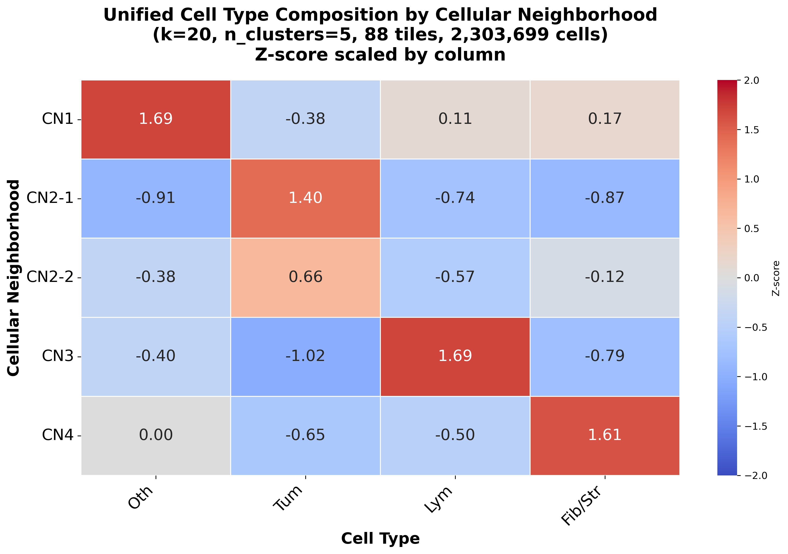
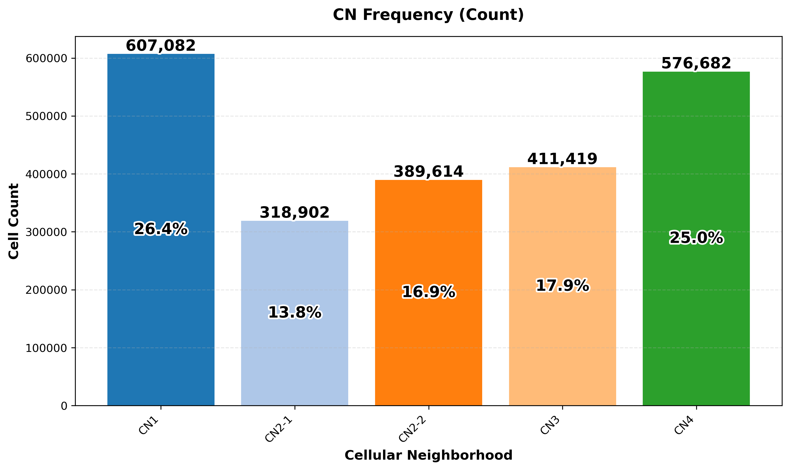

# Spatial Contexts & Cellular Neighborhoods (CN)

Scripts for **unified cellular neighborhood (CN)** detection across HandE tiles, visualization by tissue group, and optional sub-clustering of selected CNs.

Inputs are per-tile `.h5ad` files from `neighborhood_composition/data_preparation.py` (4-class labels: Others, Tumor, Lymphocyte, Fibroblast/Stroma).

---

## Suggested pipeline

```text
h5ad tiles
  ├─► cn_unified_kmeans.py              # 1. define shared CNs (core)
  │     └─► cn_unified_kmeans_groups.py # 2. figures / tile-group analysis
  │
  └─► cn_subcluster.py                  # 3. refine selected CNs
        └─► cn_unified_kmeans_groups.py # re-plot with --cn_key cn_celltype_sub
```

Supporting data: `tile_categories_88_tiles.json` (tile → group: `bg`, `margin`, `tumour_inv`, …).

---


## 1. `cn_unified_kmeans.py` — **core CN detection**

Loads many tiles together, builds neighbor cell-type composition features, and runs **k-means on all cells at once** so CN labels are shared across tiles. Writes annotated per-tile h5ads and composition tables (plots are handled by the groups script).

**Example:**

```bash
cd neighborhood_composition/spatial_contexts

python cn_unified_kmeans.py \
  --tiles_dir "/path/to/pred/h5ad" \
  --output_dir "cn_unified_results" \
  --k 20 \
  --n_clusters 4 \
  --celltype_key cell_type
```

**Useful flags:** `--max_tiles` (test run), `--pattern "*.h5ad"`, `--random_state`, `--no_offset`.

**Main outputs:** under `--output_dir` (often also `all_n_cluster=<n>/…` depending on how you organize runs):

- `processed_h5ad/<tile>_adata_cns.h5ad` — CN labels in `obs['cn_celltype']`
- composition / analysis CSVs used by downstream scripts

---


## 2. `cn_unified_kmeans_groups.py` — **main visualization**

Reads CN-annotated h5ads and produces:

1. Unified analysis — CN composition heatmap, overall / per-tile CN frequency
2. Individual tile spatial CN maps
3. Group-specific plots — compare CNs by tile groups from `tile_categories_88_tiles.json`

**Example:**

```bash
python cn_unified_kmeans_groups.py \
  --processed_h5ad_dir "/path/to/cn_unified_results_n=4/processed_h5ad" \
  --categories_json "tile_categories_88_tiles.json" \
  --output_dir "/path/to/cn_unified_results_n=4/groups" \
  --cn_key cn_celltype \
  --k 20 \
  --n_clusters 4
```

For sub-clustered results, use `--cn_key cn_celltype_sub` (auto-set if the path contains `_sub`).

**Optional:** `--group margin` (one group only), `--no-generate_unified`, `--no-generate_individual`.

### Example results

**CN composition heatmap**


**Overall CN frequency**


**Per-tile CN frequency (all groups)**


**Individual tile spatial CN map (tile example)**


**Group-specific frequency (**`bg, 17 tiles combined`**)**


**Cell-fraction difference vs overall (**`bg, 17 tiles combined`**)**


---


## 3. `cn_subcluster.py` — **split selected CNs**

Partitions cells from chosen parent CNs into non-overlapping child CNs using neighbor composition only (e.g. CN3 → CN3-1, CN3-2).

**Example:**

```bash
python cn_subcluster.py \
  --results_root "/path/to/cn_unified_results" \
  --n_clusters 4 \
  --subcluster_config "2:2,3:2"
```

Writes `all_n_cluster=4_sub/` with updated `processed_h5ad/`, `unified_cn_composition_sub.csv`, and `subcluster_config.json`. Labels go in `obs['cn_celltype_sub']`.

Re-run `cn_unified_kmeans_groups.py` on the `_sub` `processed_h5ad` (with `--cn_key cn_celltype_sub`) to refresh figures.

### Example results (after subclustering)

**CN composition heatmap (sub)**



**Overall CN frequency (sub)**



---


## Minimal end-to-end example

```bash
cd neighborhood_composition/spatial_contexts

# 1) Detect CNs (shared labels across tiles)
python cn_unified_kmeans.py \
  --tiles_dir "/path/to/pred/h5ad" \
  --output_dir "cn_unified_results_n=4" \
  --n_clusters 4 --k 20

# 2) Visualize (+ tissue groups)
python cn_unified_kmeans_groups.py \
  --processed_h5ad_dir "cn_unified_results_n=4/processed_h5ad" \
  --categories_json "tile_categories_88_tiles.json" \
  --output_dir "cn_unified_results_n=4/groups" \
  --n_clusters 4

# 3) Optional: subcluster selected CNs, then re-plot
python cn_subcluster.py \
  --results_root "cn_unified_results" \
  --n_clusters 4 \
  --subcluster_config "2:2,3:2"

python cn_unified_kmeans_groups.py \
  --processed_h5ad_dir "cn_unified_results/all_n_cluster=4_sub/processed_h5ad" \
  --categories_json "tile_categories_88_tiles.json" \
  --output_dir "cn_unified_results/all_n_cluster=4_sub/groups" \
  --cn_key cn_celltype_sub \
  --n_clusters 4
```

---


## Notes

- Relative image paths assume this README lives in `spatial_contexts/` next to `example_pic/`.
- Several scripts `chdir` to this folder; relative paths are relative to `spatial_contexts/`.
- Cell-type abbreviation / order for heatmaps assumes the 4-class names from `type_info_4class.json`.
