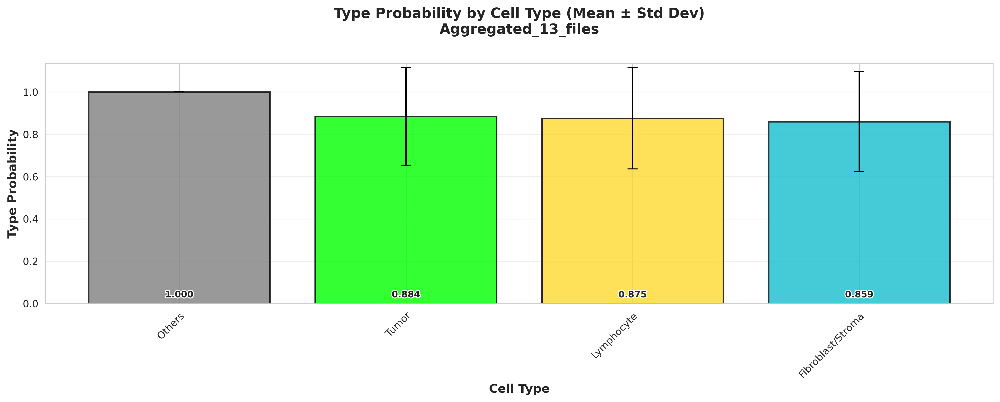
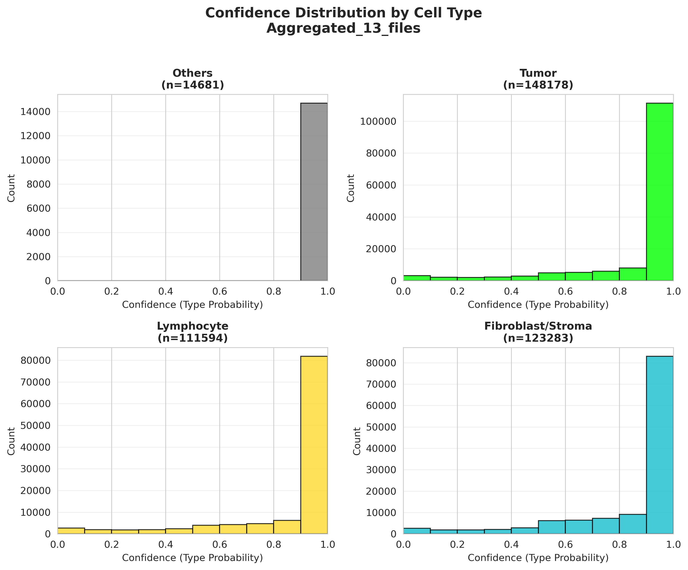
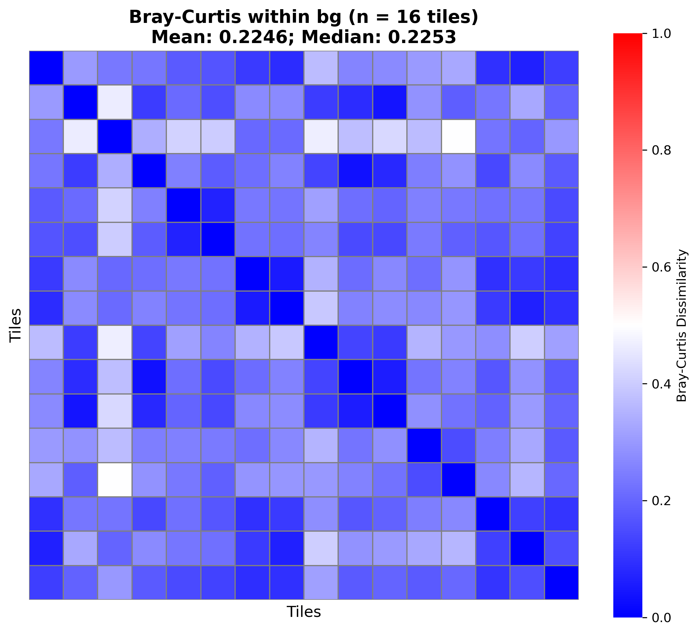
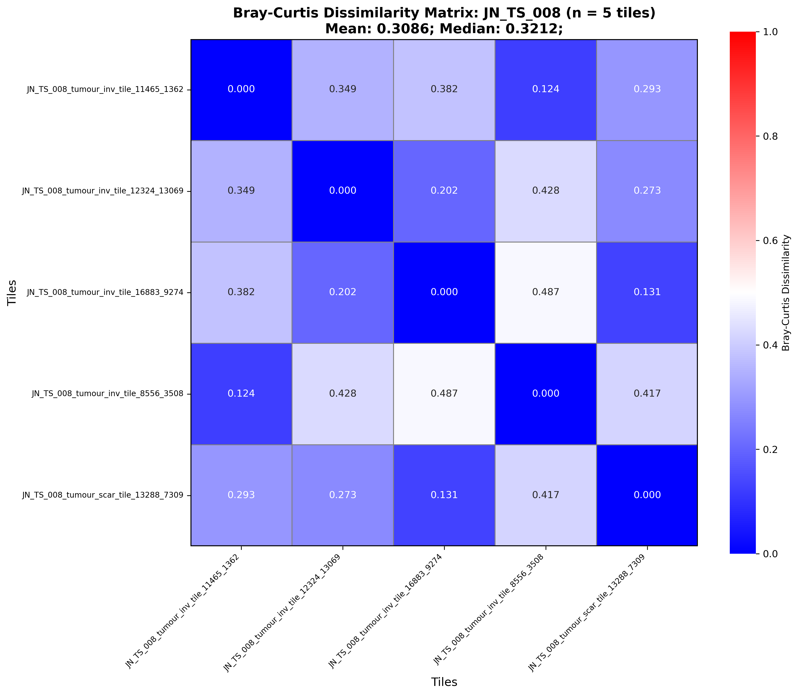

# Quantitative Analysis

Scripts for summarizing NucSegAI cell-type predictions across tiles and measuring compositional similarity with Bray–Curtis dissimilarity.

Inputs are per-tile NucSegAI JSON files. Cell-type names and colors come from project-root `type_info_4class.json` (Others, Tumor, Lymphocyte, Fibroblast/Stroma) via `cell_type_utils.py`.

---

## Suggested pipeline

```text
NucSegAI JSON tiles
  ├─► cell_type_distribution_batch.py   # cohort cell-type counts / confidence
  │     (or cell_type_distribution_single.py for one tile)
  │
  ├─► bray_curtis_tile.py               # BC across tiles (+ per tissue group)
  └─► bray_curtis_per_case.py           # BC within each case (tumour tiles)
```

Supporting helper: `cell_type_utils.py` (shared type-info loading and validation).

Tile tissue groups for Bray–Curtis follow  
`neighborhood_composition/spatial_contexts/tile_categories_88_tiles.json`  
(`bg`, `margin`, `tumour_inv`, `tumour_lep`).

---


## 1. Cell-type distribution


### `cell_type_distribution_batch.py`

Aggregate cell counts, proportions, densities, and type-probability / confidence summaries over **all** JSON tiles in a directory. Writes CSVs and figures under `ctd_batch/` (or `--output-dir`).

Also produces a **confidence-filtered** series (low-confidence cells reclassified as Others) using `--confidence-threshold` (default `0.5`).

**Example:**

```bash
cd quantitative_analysis

python cell_type_distribution_batch.py \
  --input-dir "/path/to/pred/json" \
  --output-dir "ctd_batch" \
  --type-info "../type_info_4class.json" \
  --confidence-threshold 0.5 \
  --tile-area-mm2 4.0
```


### Example results (unfiltered)

**Cell-type distribution (counts + proportions)**


**Type probability by cell type (mean ± std)**



**Confidence (type probability) histograms by cell type**



### Filtered outputs (not shown)

The same scripts also write filtered counterparts when a confidence threshold (usually 0.5) is applied.


### `cell_type_distribution_single.py`

Same metrics and figure styles for **one** tile. Useful for debugging.

**Example:**

```bash
python cell_type_distribution_single.py \
  --json "/path/to/tile.json" \
  --output-dir "ctd_single" \
  --type-info "../type_info_4class.json"
```

---


## 2. Bray–Curtis across tiles — `bray_curtis_tile.py`

Builds a cell-type **proportion vector** per tile (using the 4-class order), then computes pairwise Bray–Curtis dissimilarity. Tiles are ordered by tissue group from `tile_categories_88_tiles.json`.

Outputs (under `bray_curtis/` by default):

- Overall heatmap + CSV across all categorized tiles  
- Optional **per-group** heatmaps (`bg`, `margin`, `tumour_inv`, `tumour_lep`)

**Example:**

```bash
python bray_curtis_tile.py \
  --json-dir "/path/to/pred/json" \
  --tile-categories-json "../neighborhood_composition/spatial_contexts/tile_categories_88_tiles.json" \
  --output-dir "bray_curtis" \
  --type-info "../type_info_4class.json"
```

Useful flags: `--no-per-group`, `--show-tile-names`, `--no-show-group-names-on-axis`.

### Example results

**Overall Bray–Curtis (all categorized tiles)**


**Per-group example (**`bg`**)**




---


## 3. Bray–Curtis per case — `bray_curtis_per_case.py`

For each case ID, compares **tumour_inv** and **tumour_lep** tiles only (filenames may still contain legacy `tumour_scar`; those map to `tumour_lep`). Writes one heatmap + CSV per case under `bray_curtis_case/`.

**Example:**

```bash
python bray_curtis_per_case.py \
  --json-dir "/path/to/pred/json" \
  --output-dir "bray_curtis_case" \
  --type-info "../type_info_4class.json"
```


### Example result

**Case** `JN_TS_008` **(example)**




---


## 4. `cell_type_utils.py` — shared helpers

Used by the scripts above (not usually run alone):

- Load `type_info_4class.json` (names, colors, id order)
- Validate / cast JSON `type` ids
- Build per-tile proportion vectors for Bray–Curtis

---


## Minimal end-to-end example

```bash
cd quantitative_analysis

# 1) Cohort cell-type summary
python cell_type_distribution_batch.py \
  --input-dir "/path/to/pred/json" \
  --output-dir "ctd_batch"

# 2) Bray–Curtis across tiles
python bray_curtis_tile.py \
  --json-dir "/path/to/pred/json" \
  --output-dir "bray_curtis"

# 3) Bray–Curtis within cases
python bray_curtis_per_case.py \
  --json-dir "/path/to/pred/json" \
  --output-dir "bray_curtis_case"
```

---


## Notes

- Relative image paths above assume this README lives in `quantitative_analysis/` next to `example_pic/`.
- Default `--type-info` points at the project-root 4-class JSON; override if needed.
- Bray–Curtis only includes tiles listed in the categories JSON (and matching files under `--json-dir`).

